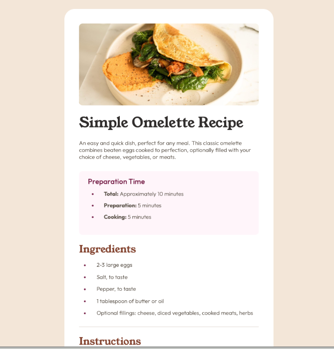

# Frontend Mentor - Recipe page solution
This is a solution to the [Recipe page challenge on Frontend Mentor](https://www.frontendmentor.io/challenges/recipe-page-KiTsR8QQKm). 

## Overview
Created a static Recipe page, styled using CSS. 

### Screenshot 

### Links
- Solution URL: [https://github.com/Akshatasarawgi/Recipe-Page]
- Live Site URL: [https://recipepagefem.netlify.app]

### Built with

- Semantic HTML5 markup
- CSS custom properties
- Flexbox
- CSS Grid
